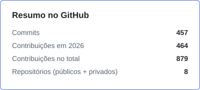
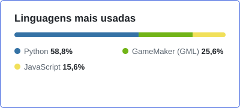
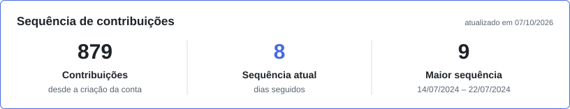

## Olá, Eu sou o Jean 👋
### Bem vindo(a)! 😎

- 💻 Desenvolvedor Full Stack — Python e Django
- 🎮 Desenvolvedor de jogos indie em GameMaker
- 🤓 Aprendendo sobre Django, Python, Javascript, GameMaker!

##

  <picture>
    <source media="(prefers-color-scheme: dark)" srcset="assets/resumo-dark.svg">
    
  </picture>
  <picture>
    <source media="(prefers-color-scheme: dark)" srcset="assets/linguagens-dark.svg">
    
  </picture>
   
  <picture>
    <source media="(prefers-color-scheme: dark)" srcset="assets/sequencia-dark.svg">
    
  </picture>
   
  Os números incluem repositórios privados e são atualizados todo dia.

##

### 🛠️ Projetos em andamento
> 🔒 Repositórios privados

| Projeto | Sobre |
|---|---|
| 🤖 **JitaBOT** | Bot de Discord em Python (discord.py) para o meu servidor: contador de membros, limpeza de mensagens e relatório de erros. Sendo modernizado para slash commands e hospedagem 24/7. |
| 💰 **WalletPI** | Gestão financeira pessoal em Django: receitas e despesas por categoria, metas, carteira de investimentos com importação de notas de corretagem e exportação em PDF/Excel. |
| 🎒 **BagBreaker** | Jogo clicker/idle em GameMaker. |
| 📚&nbsp;**JetLibraryGM** | Minha biblioteca pessoal de funções reutilizáveis para GameMaker. |

##

### 🎮 Meus jogos

<table>
  <tr>
    <td align="center"><a href="https://jetodev.itch.io/pacdimensional"> <b>PacDimensional</b></a> Plataforma · NoneJam12</td>
    <td align="center"><a href="https://jetodev.itch.io/mirroed"> <b>Mirroed</b></a> Puzzle · Almas Espelhadas</td>
    <td align="center"><a href="https://jetodev.itch.io/santa-goes-snowyfast"> <b>Santa Goes Snowy Fast!</b></a> Sobrevivência</td>
  </tr>
  <tr>
    <td align="center"><a href="https://jetodev.itch.io/knights-fall"> <b>Knight's Fall</b></a> Plataforma · Protótipo</td>
    <td align="center"><a href="https://jetodev.itch.io/a-vinganca-de-krampus-proteja-o-natal"> <b>A Vingança de Krampus</b></a> Proteja o Natal</td>
    <td align="center"></td>
  </tr>
</table>

##

### 🧰 Tecnologias

  
  
  
  
  
   
  
  
  

##

  
  
  
  

